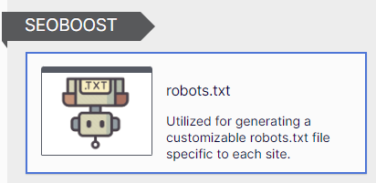

# SEOBOOST for Optimizely

## Description
[](https://docs.microsoft.com/en-us/dotnet/)
[](http://world.episerver.com/cms/)
[](http://world.episerver.com/cms/)

This package empowers developers and editors to enhance the website's SEO ranking through the utilization of helpful methods and features it offers.

## Features

* **robots.txt:** Editors can manage the robots.txt file seamlessly through the SBRobotsTxt pagetype.

* **Canonical Link:** It provides support for a Custom canonical tag in the CMS (if any), partial routing, Simple address, Page shortcuts (Fetchdata, Internal shortcut), multi-site & multi-domain support, and automatic handling of trailing slashes.

* **Alternate Links (hreflang attributes):** Similar to Canonical Link support, it includes features such as Custom canonical tags in the CMS, partial routing, Simple address, Page shortcuts (Fetchdata, Internal shortcut),  multi-site & multi-domain support, and automatic trailing slash handling.

* **Breadcrumbs item:** This feature aids in the administration of breadcrumb items, contributing to an enhanced navigational experience.

## Installation
To install the SEOBOOST, begin by adding the NuGet package using [Optimizely NuGet](https://nuget.optimizely.com/):

```
dotnet add package SeoBoost
```

## Configuration

Add the SEOBOOST handler in the Startup.cs within the ConfigureServices method. Here's an example with all available configurations:

```C#
public void ConfigureServices(IServiceCollection services)
{
    
    services.AddSeoBoost(x =>
    {
        x.CustomCanonicalTagFieldName = "CanonicalTag"; // Default ""
        x.UseSimpleAddressAsPath = true; // Default false
        x.EnableRobotsTxtSupport = true; // Default false
        x.UseMirrorPageReference = true; // Default true
        x.UseSiteUrlAsHost = true; // Default false
    });

    OR

    services.AddSeoBoost();
    
...
}
```

Ensure that one of these is called in the **Configure** method to enable the **/robots.txt** route to function properly.


```C#

app.UseEndpoints(endpoints =>
{
    endpoints.MapControllerRoute(name: "default", pattern: "{controller=Home}/{action=Index}/{id?}");
});

OR

app.UseEndpoints(endpoints =>
{
    endpoints.MapDefaultControllerRoute();
});

OR

app.UseEndpoints(endpoints =>
{
    endpoints.MapControllers();
});
```

In addition, the configuration can be read from the `appsettings.json`:

```Json
"SeoBoost": {
    "CustomCanonicalTagFieldName":  "CanonicalTag", // Default "", 
    "UseSimpleAddressAsPath": true, // Default false
    "EnableRobotsTxtSupport": true, // Default false,
    "UseMirrorPageReference": true, // Default true,
    "UseSiteUrlAsHost": true, // Default false,
}
```

The settings specified in the `appsettings.json` file will take precedence over any configurations defined in the Startup.

### SEOBOOST Options Details

#### 1. CustomCanonicalTagFieldName

The custom canonical field within a Content Management System (CMS) simplifies the responsibilities of editors in overseeing SEO-related elements. The **CustomCanonicalTagFieldName** field empowers developers to specify the property name for SEOBOOST. This enables the code to retrieve the property value and, if provided, use it to generate a URL for canonical or alternative links.

#### 2. UseSimpleAddressAsPath

If a Simple Address or Short URL is supplied for the page in CMS, and the **UseSimpleAddressAsPath** option is configured as **true**, the URL generated for canonical or alternative links will incorporate that address.

#### 3. UseMirrorPageReference

If Page shortcuts on the shortcut property (Fetchdata, Internal shortcut) are configured, this option ensures that the URL generated for canonical or alternative links will include the value of the page whose shortcut has been used. This helps in preventing duplicate content issues.

#### 4. UseSiteUrlAsHost

The default behavior is for the host part of the URL to be generated based on the primary hostname set in site settings. However, this option ensures that the site URL property is used instead of the primary hostname.

#### 5. EnableRobotsTxtSupport

Enabling this option will activate support for the **robots.txt** file in the CMS, making a **robots.txt** page type available to editors and establishing the **/robots.txt** route.

## How to Use

Include the following at the top of the master page.

``` C# 
@using SeoBoost.Extensions 
``` 
    
### Canonical link
Incorporate the following extension within the <**head**> section

``` C# 
@Html.GetCanonicalLink() 
``` 

### Alternate links (hreflang attributes)
Incorporate the following extension within the <**head**> section

``` C# 
@Html.GetAlternateLinks() 
``` 

### Breadcrumbs items
Use the following extension where required.

``` C# 
@Html.GetBreadcrumbItemList() 
``` 

Example:

 ``` C#                    
@{var breadCrumbList = SeoBoost.Extensions.BreadcrumbExtensions.GetBreadcrumbItemList(Model.CurrentPage);}

<ol class="breadcrumbs" itemscope itemtype="http://schema.org/BreadcrumbList">
    @{
        foreach (var item in breadCrumbList)
        {
            if (item.Selected)
            {
                <li itemprop="itemListElement" itemscope itemtype="http://schema.org/ListItem" class="active">
                    <span itemprop="name">@item.PageData.PageName</span>
                    <meta content="@item.Position" itemprop="position">
                </li>
            }
            else if (item.PageData.HasTemplate() && !item.PageData.ContentLink.CompareToIgnoreWorkID(CURRENTPAGE.ContentLink))
            {
                <li itemprop="itemListElement" itemscope itemtype="http://schema.org/ListItem">
                    <a href="@Url.ContentUrl(item.PageData.ContentLink)" itemprop="item" itemscope itemtype="http://schema.org/Thing">
                        <span itemprop="name">@item.PageData.PageName</span>
                    </a>
                    <meta content="@item.Position" itemprop="position">
                </li>
            }
            else //OPTIONAL
            {
                <li itemprop="itemListElement" itemscope itemtype="http://schema.org/ListItem">
                    <span itemprop="name">@item.PageData.PageName</span>
                    <meta content="@item.Position" itemprop="position">
                </li>
            }
            <span class="divider">/</span>
        }
    }
</ol> 
``` 

### Trailing Slash Support

SEOBOOST provides support for trailing slashes in Canonical and Alternate links (hreflang attributes) by listening to the following routing option in the Configure method.

 ``` C#   
services.Configure<RoutingOptions>(options =>
{
    options.UseTrailingSlash = false;
});
 ```

### robots.txt

The concept behind this feature is straightforward: to offer editors the flexibility to modify the robots.txt file seamlessly.

Editors can achieve this by creating a Robots.txt page, supported by the SBRobotsTxt PageType, under the Start Page for the respective site.




It is advisable to consider deleting any existing physical robots.txt file in the site root or wwwroot. Additionally, it is recommended to consistently purge the CDN cache after deploying or restarting the site. This practice ensures that the editable robots.txt content loads seamlessly from the route without encountering any issues.

To enable the functionality of robots.txt, editors must activate the **EnableRobotsTxtSupport** in strtup.cs

```C#
public void ConfigureServices(IServiceCollection services)
{    
    services.AddSeoBoost(x =>
    {        
        x.EnableRobotsTxtSupport = true;     
    });
}
```

### Additional Helper Methods

There are some helper methods in the package to get external URLs of the page. The developer can use these methods for their implementations 

usage 

``` C#   
    var urlHelper = ServiceLocator.Current.GetInstance<SeoBoost.Business.Url.IUrlService>();
```

There are two methods available to get external URLs for the content 

``` C#  
    string GetExternalUrl(ContentReference contentReference, CultureInfo culture);
    string GetExternalUrl(ContentReference contentReference);
```

## Sandbox App
Sandbox application is testing poligon for package new features and bug fixes.

**ADMIN**

Username: **admin**

Username: **sysadmin**

Password: **Sandbox#123**

## Contributing

If you can help please do so by contributing to the package! Reach out package maintainer for additional details if needed.

## Feature Requests

If you have new ideas or feature requests that can make this tool even more useful for you or the community, please feel free to open a new issue at the following link.

https://github.com/adnanzameer/optimizely-seoboost/issues


## Optimizely (Episerver) CMS 11 Support

For users still on Optimizely (Episerver) CMS 11, SEOBOOST is available on: https://github.com/adnanzameer/SEOBOOST

## Changelog

[Changelog](CHANGELOG.md)
