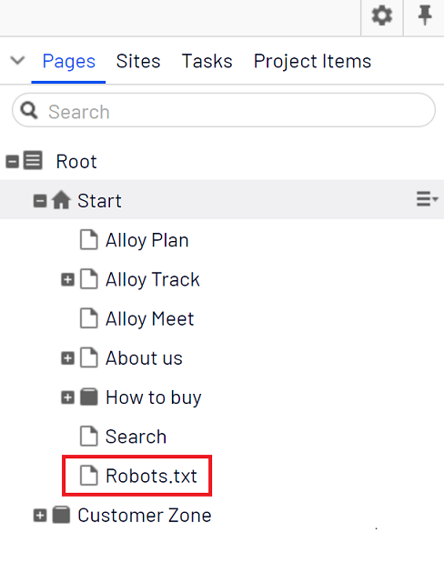

# SEOBOOST for Optimizely

## Description
This package facilitates developers and editors to improve the SEO ranking of the website by utilizing helper methods & features provided.

## Features
The package provides the following helper methods & features:
* robots.txt
* Canonical Link 
* Alternate Links (hreflang attributes)
* Breadcrumbs items

## How to get started?
Install NuGet package from Optimizely NuGet Feed:


[](https://msdn.microsoft.com/en-us/library/w0x726c2%28v=vs.110%29.aspx)
[](http://world.episerver.com/cms/)

### .NET Core (.NET 5.0)


Start by installing NuGet package (use [Optimizely NuGet](https://nuget.optimizely.com/)):

```
dotnet add package SeoBoost
```

Register SEOBOOST in Startup.cs using folllowing service extension 

```csharp
services.AddSeoBoost();
```

Then, call `UseSeoBoost` in the `Configure` method:

```csharp
app.UseSeoBoost();
```

Register custom route if `robots.txt` not working in the URL
```csharp
        app.UseEndpoints(endpoints =>
        {
            endpoints.MapControllerRoute(
                name: "robots",
                pattern: "robots.txt",
                defaults: new { controller = "SBRobotsTxt", action = "Index" });
        });
```

[](https://msdn.microsoft.com/en-us/library/w0x726c2%28v=vs.110%29.aspx)
[](http://world.episerver.com/cms/)

### .NET Framework (4.7.1)

Install NuGet package from Optimizely NuGet Feed:

```
    Install-Package SeoBoost
```
	
## How to use

Include the follow **@using SeoBoost.Helper** at top of the Mater page.
     
### Canonical link
Use the following extension **@Html.GetCanonicalLink()** within **<head></head>** section.
     
### Alternate links (hreflang attributes)
Use the following extension **@Html.GetAlternateLinks()** within **<head></head>** section.

### Breadcrumbs items
Use the following extension **@Html.GetBreadcrumbItemList()** where required.

Example:
                    
       @{ var breadCrumbList = Html.GetBreadcrumbItemList(ContentReference.StartPage); }

       <ol class="breadcrumbs" itemscope itemtype="http://schema.org/BreadcrumbList">
            @{
                foreach (var item in breadCrumbList)
                {
                    if (item.Selected)
                    {
                        <li itemprop="itemListElement" itemscope itemtype="http://schema.org/ListItem" class="active">
                            <span itemprop="name">@item.PageData.PageName</span>
                            <meta content="@item.Position" itemprop="position">
                        </li>
                    }
                    else if (item.PageData.HasTemplate() && !item.PageData.ContentLink.CompareToIgnoreWorkID(CURRENTPAGE.ContentLink))
                    {
                        <li itemprop="itemListElement" itemscope itemtype="http://schema.org/ListItem">
                            <a href="@Url.ContentUrl(item.PageData.ContentLink)" itemprop="item" itemscope itemtype="http://schema.org/Thing">
                                <span itemprop="name">@item.PageData.PageName</span>
                            </a>
                            <meta content="@item.Position" itemprop="position">
                        </li>
                    }
                    else //OPTIONAL
                    {
                        <li itemprop="itemListElement" itemscope itemtype="http://schema.org/ListItem">
                            <span itemprop="name">@item.PageData.PageName</span>
                            <meta content="@item.Position" itemprop="position">
                        </li>
                    }
                    <span class="divider">/</span>
                }
            }
        </ol> 
       
### robots.txt

The idea behind this feature is simple, provide editors with the flexibility to change robots.txt file on the go. 

The Robots.txt page (backed by SBRobotsTxt PageType) should be created by the editor for the site under Start Page. 



The physical rebots.txt file content (if any) will be replaced with the CMS robobts.txt page content. The fallback behaviour of /robots.txt URL is the content of physical rebots.txt file (if any) otherwise the default 404 error page will be shown.

**IMPORTANT**: 
* If there is a physical robot.txt exist in the site root, always purged the CDN cache after the deploy or site restart. It is a recommendation to delete physical robots.txt file from the site root to ensure editable robot.txt content loads without a problem.
* If you are using IIS URL Rewrite rules to add a trailing slash at the end of the URL, add the following in the rule to ignore robots.txt route 
    
        <add input="{URL}" pattern="\robots.txt" negate="true" />

### Additional helper methods

There are some helper methods in the package to get external URLs of the page. The developer can use these methods for their implementations 

usage 

      var urlHelper = ServiceLocator.Current.GetInstance<SeoBoost.Business.Url.IUrlService>();


There are three methods available to get external URL for the content 

       string GetExternalUrl(ContentReference contentReference);
       string GetExternalFriendlyUrl(ContentReference contentReference, string culture);
       string GetExternalFriendlyUrl(ContentReference contentReference);

## Changelog

[Changelog](CHANGELOG.md)
